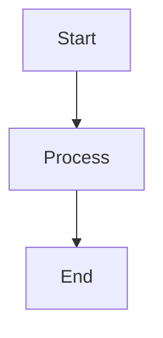
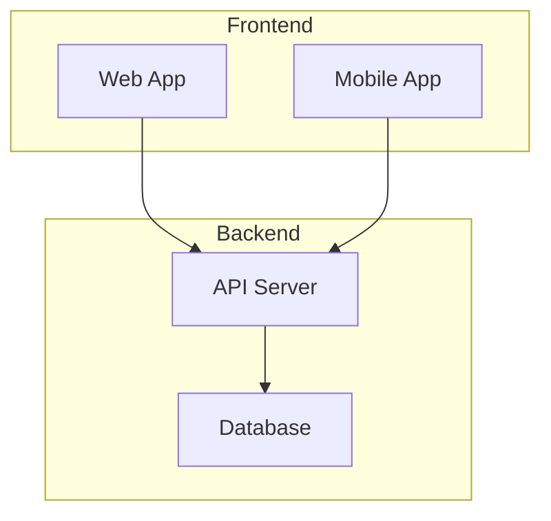

# Mermaid Graph Viewer

A Docker-based Mermaid.js graph viewer with real-time updates and interactive features. 
Renders Mermaid diagrams as high-resolution PNG images with zoom, pan, and search capabilities. 
Perfect for system architecture visualization and dynamic graph generation.

## Features

- **Real-time Graph Rendering**: Beautiful system architecture diagrams using Mermaid.js
- **Interactive Operations**: Zoom, pan, search, and highlight functionality
- **Real-time Updates**: Instant graph updates via WebSocket
- **Export Functionality**: Save graphs in PNG and SVG formats
- **Theme Switching**: Dark, light, forest, and neutral themes
- **Responsive Design**: Mobile and desktop compatible
- **Fullscreen Display**: Fullscreen mode for presentations
- **High-resolution PNG Export**: Customizable resolution for professional output
- **Dynamic Port Assignment**: Automatic port allocation to avoid conflicts

## Technology Stack

- **Node.js**: Server-side execution environment
- **Express.js**: Web server framework
- **Mermaid.js**: Graph rendering engine
- **WebSocket**: Real-time communication
- **Docker**: Containerization
- **Puppeteer**: High-resolution PNG generation

## Quick Start

### Using Docker (Dynamic Port)

```bash
# Build the container
docker build -t mermaid-graph-viewer .

# Run the container with dynamic port assignment
docker run -d \
  --name mermaid-graph-viewer \
  -p 0:8080 \
  mermaid-graph-viewer

# Check the assigned port
docker port mermaid-graph-viewer
```

### Using Docker (Fixed Port)

```bash
# Run the container with specific port
docker run -d \
  --name mermaid-graph-viewer \
  -p 8080:8080 \
  mermaid-graph-viewer
```

### Using Docker (Custom Port)

```bash
# Run the container with custom port
docker run -d \
  --name mermaid-graph-viewer \
  -p 9000:8080 \
  -e PORT=8080 \
  mermaid-graph-viewer
```

### Local Development

```bash
# Install dependencies
npm install

# Start development server
npm run dev

# Start production server
npm start
```

## Port Management

### Dynamic Port Assignment
The container supports dynamic port assignment to avoid conflicts with other services:

```bash
# Let Docker assign an available port
docker run -d -p 0:8080 mermaid-graph-viewer

# Check assigned port
docker port mermaid-graph-viewer
# Output: 8080/tcp -> 0.0.0.0:32768
```

### Finding Container Port
To find the port assigned to the container:

```bash
# Method 1: Using docker port
docker port mermaid-graph-viewer

# Method 2: Using docker inspect
docker inspect mermaid-graph-viewer | grep -A 10 "PortBindings"

# Method 3: Using docker ps
docker ps --format "table {{.Names}}\t{{.Ports}}"
```

### Integration with Other Applications
When integrating with other applications (like Mochimaki), use the following approach:

```python
import subprocess
import json

def get_container_port(container_name="mermaid-graph-viewer"):
    """Get the external port assigned to the container"""
    try:
        result = subprocess.run(
            ["docker", "port", container_name],
            capture_output=True,
            text=True,
            check=True
        )
        
        # Parse port mapping (e.g., "8080/tcp -> 0.0.0.0:32768")
        port_line = result.stdout.strip().split('\n')[0]
        external_port = port_line.split('->')[1].split(':')[1]
        
        return external_port
    except subprocess.CalledProcessError:
        return None

def open_browser():
    """Open browser with dynamic port"""
    port = get_container_port()
    if port:
        url = f"http://localhost:{port}"
        # Open browser with the URL
        print(f"Opening browser: {url}")
    else:
        print("Container not found or not running")
```

## API Specification

### Endpoints

#### GET /api/health
Health check endpoint

**Response:**
```json
{
  "status": "healthy",
  "timestamp": "2024-01-01T12:00:00.000Z",
  "service": "mermaid-graph-viewer"
}
```

#### GET /api/graph
Get current graph data

**Response:**
```json
{
  "mermaidContent": "graph TD\n    A[Start] --> B[End]",
  "graphData": {
    "pngPath": "/api/graph-image",
    "timestamp": "2024-01-01T12:00:00.000Z"
  },
  "timestamp": "2024-01-01T12:00:00.000Z"
}
```

#### POST /api/update
Update graph with new Mermaid content

**Request:**
```json
{
  "mermaid_content": "graph TD\n    A[Start] --> B[End]",
  "file_path": "/path/to/mermaid.txt",
  "timestamp": "2024-01-01T12:00:00.000Z"
}
```

#### GET /api/graph-image
Get current graph as PNG image

**Response:** PNG image file

#### WebSocket /ws/graph-updates
Real-time graph update notifications

**Message Format:**
```json
{
  "type": "graph_updated",
  "data": {
    "pngPath": "/api/graph-image",
    "timestamp": "2024-01-01T12:00:00.000Z"
  }
}
```

## Usage Examples

### Basic Mermaid Diagram


### System Architecture


## Configuration

### Environment Variables

- `PORT`: Server port (default: 8080)
- `NODE_ENV`: Execution environment (development/production)

### Mermaid.js Configuration

Customize Mermaid.js settings in `server.js`:

```javascript
mermaid.initialize({
  startOnLoad: false,
  theme: 'dark',
  flowchart: {
    useMaxWidth: false,
    htmlLabels: true,
    curve: 'basis'
  },
  securityLevel: 'loose'
});
```

## Development

### Project Structure

```
mermaid-container/
├── Dockerfile              # Docker configuration
├── package.json            # Dependencies
├── server.js               # Express.js server
├── public/                 # Static files
│   ├── index.html         # Main page
│   ├── viewer.html        # Dedicated viewer
│   ├── style.css          # Stylesheet
│   └── script.js          # Interactive features
└── README.md              # Documentation
```

### Development Commands

```bash
# Install dependencies
npm install

# Start development server (hot reload)
npm run dev

# Start production server
npm start

# Run tests
npm test
```

### Debugging

Development mode uses `nodemon` for hot reloading:

```bash
npm run dev
```

## Troubleshooting

### Common Issues

1. **Graph not displaying**
   - Check browser console for errors
   - Verify Mermaid.js syntax
   - Check WebSocket connection status

2. **WebSocket connection errors**
   - Verify firewall settings
   - Ensure port is open
   - Check proxy configuration

3. **Port conflicts**
   - Use dynamic port assignment: `docker run -d -p 0:8080 mermaid-graph-viewer`
   - Check available ports: `netstat -tulpn | grep LISTEN`
   - Use different port: `docker run -d -p 9000:8080 mermaid-graph-viewer`

4. **Performance issues**
   - Consider progressive rendering for large graphs
   - Monitor browser memory usage
   - Disable unnecessary animations

### Logs

Check server logs for detailed information:

```bash
# Docker logs
docker logs mermaid-graph-viewer

# Local logs
npm start
```

## License

MIT License

## Dependencies Licenses

This project uses the following open source libraries:

- **Mermaid.js**: MIT License - https://github.com/mermaid-js/mermaid
- **Express.js**: MIT License
- **Puppeteer**: Apache License 2.0
- **WebSocket**: MIT License

## Contributing

Pull requests and issue reports are welcome.

## Changelog

### v1.0.0
- Initial release
- Basic graph display functionality
- Interactive operations
- Real-time updates
- Export functionality
- Dynamic port assignment 